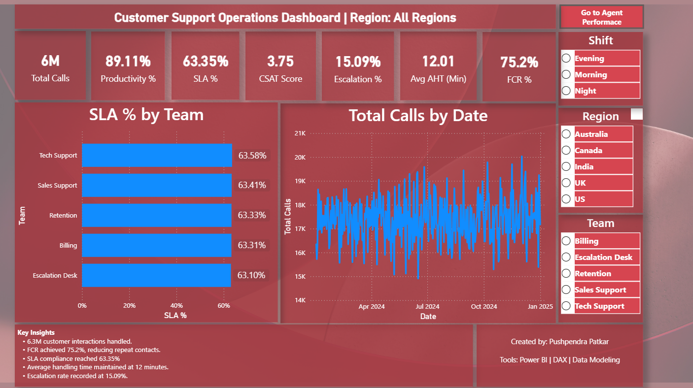
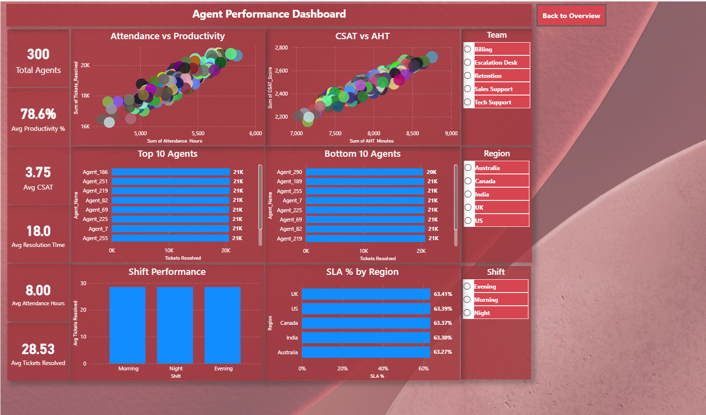
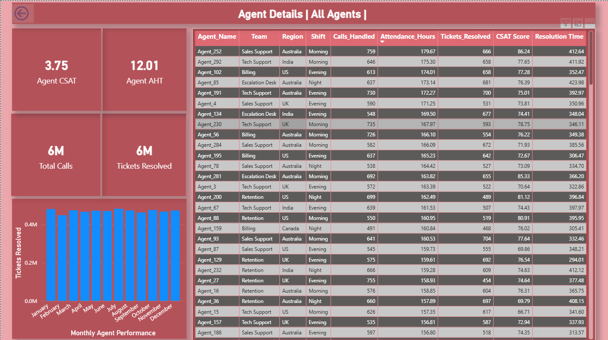

# 📊 Customer Support Operations Analytics Dashboard

An end-to-end **Power BI Dashboard** built to analyze customer support operations using a **Star Schema Data Model**, **DAX**, and **Power Query**. This project provides actionable insights into support performance, SLA compliance, customer satisfaction, agent productivity, and operational efficiency through interactive dashboards.

---

## 📌 Project Overview

The dashboard helps Operations Managers and Business Analysts monitor key customer support metrics, identify performance trends, evaluate agent productivity, and make data-driven decisions.

This project demonstrates real-world Business Intelligence practices, including:

- Data Modeling (Star Schema)
- DAX Measures
- Interactive KPI Reporting
- Drill-through Reports
- Dynamic Titles
- Slicers & Filters
- Business Insights

---

## 🛠 Tools & Technologies

- Microsoft Power BI
- Power Query
- DAX
- Data Modeling
- CSV Files
- GitHub

---

# 📂 Dataset

The project uses a **Star Schema** consisting of one fact table (split into four CSV files) and two dimension tables.

### Fact Tables

- Fact_Support_Operations_1.csv
- Fact_Support_Operations_2.csv
- Fact_Support_Operations_3.csv
- Fact_Support_Operations_4.csv

### Dimension Tables

- Dim_Agents.csv
- Dim_Teams.csv

### Data Model

- Fact Table
  - Fact_Support_Operations

- Dimension Tables
  - Dim_Agents
  - Dim_Teams

Model Type:

⭐ Star Schema

---

# 📊 Dashboard Pages

## 1️⃣ Operations Overview

This page provides an executive summary of customer support operations.

### KPIs

- Total Calls
- Productivity %
- SLA %
- CSAT Score
- Escalation %
- Average Handle Time (AHT)
- First Call Resolution (FCR %)

### Visuals

- SLA % by Team
- Total Calls Trend
- Interactive Slicers
- Dynamic Report Title
- Business Insights Summary

### Dashboard Preview



---

## 2️⃣ Agent Performance Dashboard

Analyzes individual agent performance using interactive visuals.

### KPIs

- Total Agents
- Average Productivity
- Average CSAT
- Average Resolution Time
- Average Attendance Hours
- Average Tickets Resolved

### Visuals

- Attendance vs Productivity (Scatter Plot)
- CSAT vs AHT (Scatter Plot)
- Top 10 Agents
- Bottom 10 Agents
- Shift Efficiency
- SLA % by Region

### Interactive Filters

- Team
- Region
- Shift
- Agent Name

### Dashboard Preview



---

## 3️⃣ Agent Details (Drill-through)

Displays detailed performance metrics for an individual support agent.

### Includes

- Agent KPI Cards
- Monthly Performance Trend
- Agent Information Table
- Drill-through Navigation
- Back Button

### Dashboard Preview



---

# 📈 Key Business Insights

- Monitor overall customer support performance.
- Track SLA compliance across different teams.
- Identify top-performing and low-performing agents.
- Compare productivity across shifts and regions.
- Analyze the relationship between CSAT and Average Handle Time.
- Monitor First Call Resolution (FCR) and Escalation Rate.
- Support operational decision-making with interactive reports.

---

# 📐 Data Model

This project follows Power BI best practices using a Star Schema.

```
          Dim_Agents
               │
               │
               ▼
Fact_Support_Operations
               ▲
               │
               │
          Dim_Teams
```

---

# 📊 DAX Measures Used

Some of the key DAX measures include:

- Total Calls
- Tickets Resolved
- Productivity %
- SLA %
- CSAT Score
- Average AHT
- Escalation %
- FCR %
- Total Agents

---

# ✨ Features

- Interactive KPI Cards
- Dynamic Report Titles
- Drill-through Reports
- Scatter Charts
- Bar Charts
- Trend Analysis
- Slicers & Filters
- Navigation Buttons
- Business Insights Panel
- Star Schema Data Model

---

# 📚 Skills Demonstrated

- Data Cleaning
- Data Modeling
- Power Query
- DAX
- Power BI Dashboard Development
- Business Intelligence
- KPI Reporting
- Data Visualization
- Analytical Thinking
- Performance Analysis

---

# 🎯 Business Use Case

This dashboard can be used by:

- Operations Managers
- Team Leaders
- Customer Support Managers
- Business Analysts
- Reporting Analysts

to monitor customer support performance and improve operational efficiency.

---

# 👨‍💻 Author

**Pushpendra Patkar**

**Reporting Analyst | Data Analyst | Power BI | SQL | Excel**

GitHub:
https://github.com/pushpendraptkr

LinkedIn:
[(Add your LinkedIn profile URL)](https://www.linkedin.com/in/pushpendra-patkar-084757205/)

---

## ⭐ If you found this project helpful, consider giving it a Star!
